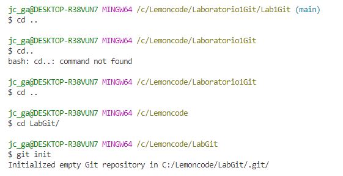
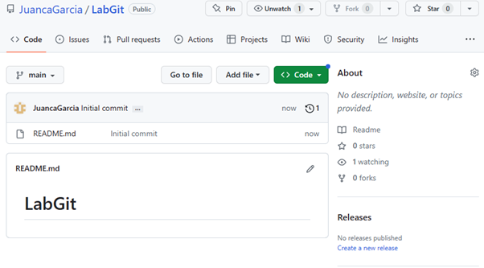
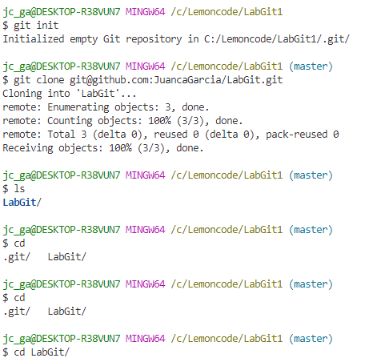
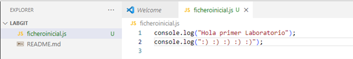
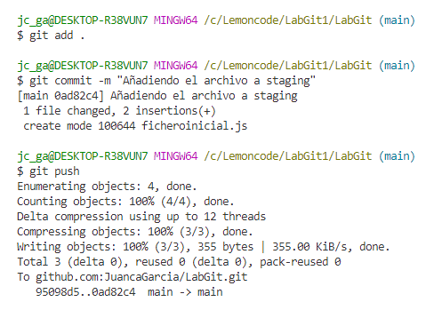
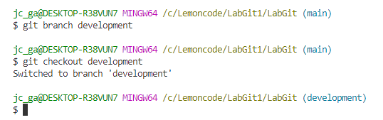
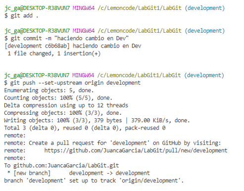
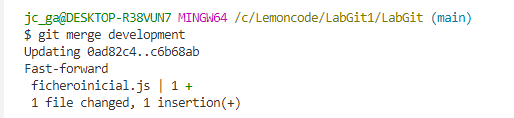
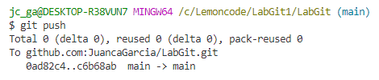

# Primer Laboratorio GitHub

## PREGUNTA 1

### 1. Crear un repositorio en local

 • Abre tu terminal y navega hasta el directorio donde deseas crear el repositorio. 

 • Crea una carpeta con el nombre del repositorio. 

 • Ingresa a la carpeta que acabas de crear.

 • Inicializa el repositorio de Git. 

## RESPUESTA:

 Inicializando git en carpeta 

## PREGUNTA 2

### 2. Subir el repositorio a GitHub

 • Crea un nuevo repositorio en GitHub. 

 • Copia el URL del repositorio que acabas de crear en GitHub. 

 • Conecta tu repositorio local con el repositorio en GitHub.

 • Verifica que la conexión se haya establecido correctamente. 

## RESPUESTA:

 Repositorio en Github

 Clonando repo e ingresando a la carpeta 

## PREGUNTA 3

### 3. Hacer un commit y un push

 • Crea un archivo en la carpeta del repositorio. 

 • Añade el archivo al staging.

 • Crea un commit con un mensaje descriptivo.

 • Sube los cambios al repositorio en GitHub. 

## RESPUESTA:

 Creando archivo en carpeta del repo. 

 Añadiendo a staging, creando un commit con msj y finalmente subiendo al repo de GitHub 

### 4. Crear una rama

 • Crea una rama nueva llamada "development".

 • Cambia a la nueva rama.

 • Realiza algunos cambios en el archivo que creaste.

 • Añade y haz un commit con los cambios en la rama "development". 

 • Sube los cambios a Github. 

## RESPUESTA:

 Creando rama “development”, cambiando a esa rama  

 Haciendo cambio al fichero, añadiéndolo y subiendo los cambios en la rama “development”

### 5. Hacer un merge

 • Vuelve a la rama "main".

 • Haz un merge de la rama "development" a la rama "main".

 • Si no hay conflictos, los cambios realizados en la rama "development" se incorporarán a la rama "main".

 • Haz un push de los cambios al repositorio en GitHub. 

## RESPUESTA:

 Volviendo a rama Main y haciendo un MERGE 

 Sin conflictos haciendo PUSH al repo de GitHub

## Muchas gracias

##

## JC
